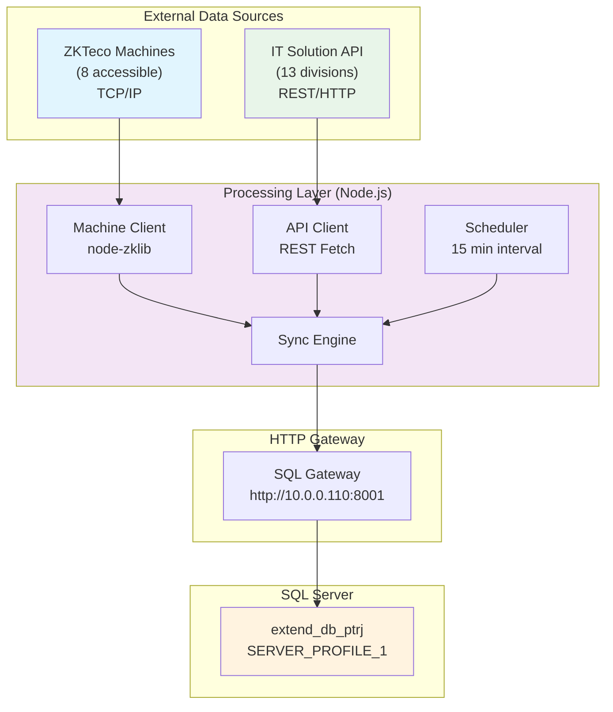
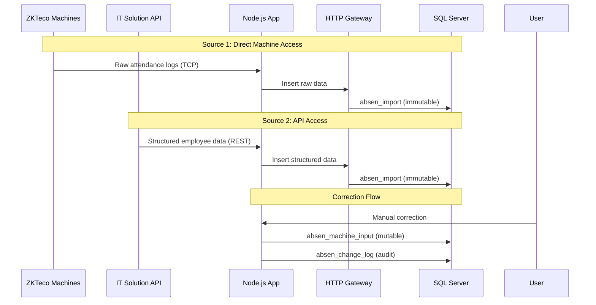

# 01_SYSTEM_OVERVIEW.md

# System Architecture Overview

## Project: Sistem Absensi PT Rebinmas Jaya

Sistem monitoring dan penyimpanan data absensi dari 15 mesin absensi di berbagai lokasi perkebunan kelapa sawit ke database SQL Server terpusat.

## High-Level Architecture Diagram



## System Components

### 1. External Data Sources

| Source | Type | Machines/Divisions | Protocol | Access Method |
|--------|------|-------------------|----------|---------------|
| ZKTeco Machines | Direct Device | 8 accessible | TCP/IP | node-zklib@1.3.0 |
| IT Solution API | REST API | 13 divisions | HTTP | Fetch API |

### 2. Processing Layer (Node.js v22.14.0)

**Key Modules:**
- `machine-client.ts` - ZKTeco device communication
- `absensi-client.ts` - IT Solution API client
- `sync.ts` - Main synchronization logic
- `scheduler.ts` - Automated scheduling
- `sql-client.ts` - Database gateway client

### 3. HTTP Gateway

**Purpose:** Bridges Node.js application to SQL Server without direct TCP connection.

**Configuration:**
- URL: `http://10.0.0.110:8001/v1/query`
- API Key: Configured in `config.ts`
- Database: `extend_db_ptrj` on `SERVER_PROFILE_1`

### 4. SQL Server Database

**Tables:**
| Table | Purpose | Mutability |
|-------|---------|------------|
| `absen_import` | Raw attendance data | IMMUTABLE |
| `absen_machine_input` | Manual corrections | MUTABLE |
| `absen_import_batch` | Batch tracking | AUDIT |
| `absen_change_log` | Change audit trail | AUDIT |
| `absen_sync_log` | Sync operation logs | AUDIT |
| `absen_config` | System configuration | CONFIG |

## Data Flow Summary



## Network Topology

```
Remote Locations (Oil Palm Plantations)
├── PGE (Head Office)              10.0.0.232:4370
├── MILL (Mill)103.127.66.32:4370
├── DME (DME Estate) 103.144.228.42:4700-4701
├── ARE (ARE Estate)               103.144.208.154:4370
├── ARA (ARA Estate)               103.144.208.154:4800
├── AB1/AB2 (Air Ruak Estate B)    103.144.208.154:4400-4900
├── ARC (Air Ruak Estate A/C)      103.144.208.154:4200-4201
├── IJL (IJL Estate)               103.144.211.226:4370
├── P1A/P1B (Parit Gunung 1)       10.0.0.90-91:4100-4300
├── P2A/P2B (Parit Gunung 2)        223.25.98.220:4500-4600

Central Server (10.0.0.110)
├── Port 5176: IT Solution API
├── Port 8001: SQL Gateway
└── Port 8002: (Reserved)
```

## Key Design Decisions

1. **Dual Data Source**: System handles both direct machine connections and API-based data collection
2. **HTTP Gateway Pattern**: Avoids direct SQL Server connections from Node.js
3. **Immutability First**: Raw import data is never modified
4. **Batch Processing**: All imports tracked via batch IDs for audit/retry
5. **Separation of Concerns**: Machine input vs API input vs manual corrections

## Technology Stack

| Component | Technology | Version |
|-----------|------------|---------|
| Runtime | Node.js | 22.14.0 |
| Language | TypeScript | 5.8.3 |
| ZKTeco Library | node-zklib | 1.3.0 |
| SQL Client | mssql | 12.5.5 |
| Database | SQL Server | (via Gateway) |
| HTTP Gateway | Custom | HTTP REST |