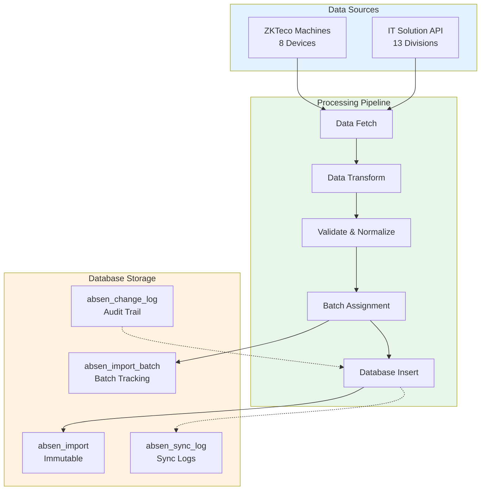
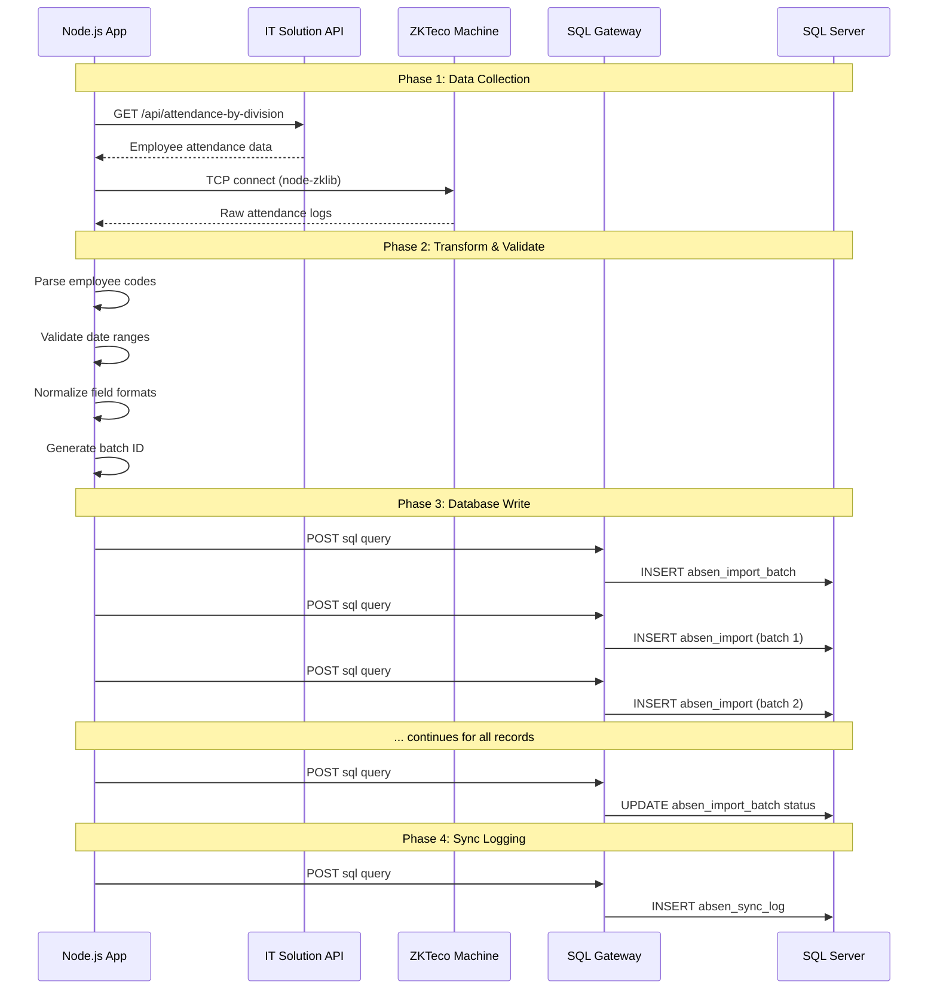
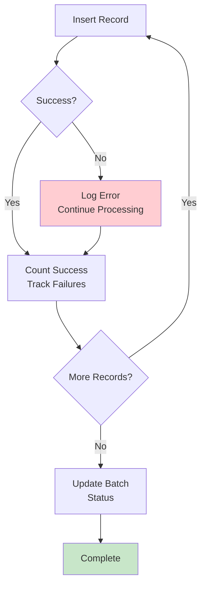

# 03_DATA_PIPELINE_ARCHITECTURE.md

# End-to-End Data Pipeline Architecture

## Overview

The attendance data pipeline flows from two sources through the Node.js processing layer to the SQL Server database, with built-in audit trails, batch tracking, and error recovery.



## Pipeline Stages

### Stage 1: Data Fetch

**ZKTeco Source:**
```typescript
// From machine-client.ts
async function connectToMachine(division: string): Promise<any[]> {
  const zk = new ZKLib({
    ip: config.ip,
    port: config.port,
    timeout: 10000,
    connectionTimeout: 4000
  });

  await zk.createSocket();
  await zk.zklibTcp.disableDevice();  // Prevent new records during read
  
  const users = await zk.getUsers();
  const attendance = await zk.getAttendances();
  
  await zk.zklibTcp.enableDevice();   // Re-enable after read
  await zk.disconnect();
  
  return attendance.data;
}
```

**API Source:**
```typescript
// From absensi-client.ts
async getAttendance(
  division: string,
  month: number,
  year: number,
  mode: "hk" | "ot" = "hk"
): Promise<any[]> {
  const result = await this.request<{ success: boolean; data: any[] }>(
    "/api/attendance-by-division",
    { division, month: month.toString(), year: year.toString(), mode }
  );
  return result.data;
}
```

### Stage 2: Data Transform

**ZKTeco to Employee Code Conversion:**
```typescript
// From machine-config.ts
function convertMachineIdToEmpCode(machineId: number | string, division?: string): string {
  const id = String(machineId);
  
  // Check if already in correct format (e.g., A1234)
  if (/^[A-Z]\d+$/.test(id)) return id;
  
  // Get division from ID suffix
  const div = division || getDivisionFromMachineId(id) || "P1A";
  
  // Map division to location code prefix
  const empPrefix = locCodeMap[div] || "X";
  
  // Extract last 4 digits and pad
  const numPart = id.slice(-4).replace(/^0+/, "") || "0";
  return `${empPrefix}${numPart.padStart(4, "0")}`;
}
```

**API Data Parsing:**
```typescript
// From sync.ts - parseAttendanceData
for (let day = 1; day <= 31; day++) {
  const dayData = row[`day_${day}`];
  
  if (!dayData) continue;
  
  // Validate day is in month
  const date = new Date(year, month - 1, day);
  if (date.getMonth() !== month - 1) continue;
  
  // Build values object
  const values = {
    emp_code: empCode,
    emp_name: empName,
    gang_code: gangCode,
    division: division,
    year: year,
    month: month,
    day: day,
    has_work: dayData.hasWork ? 1 : 0,
    is_sunday: dayData.isSunday ? 1 : 0,
    is_holiday: dayData.isHoliday ? 1 : 0,
    is_cuti: dayData.isCuti ? 1 : 0,
    is_sakit: dayData.isSakit ? 1 : 0,
    ot_hours: dayData.otHours || 0,
    attendance_date: date.toISOString().split("T")[0],
  };
}
```

### Stage 3: Validate & Normalize

Validation rules applied:
1. **Date validation**: Day must exist in specified month
2. **Employee code format**: Must match `^[A-Z][0-9]{4}$`
3. **Division mapping**: Must exist in machine config
4. **Numeric fields**: OT hours must be valid decimal

### Stage 4: Batch Assignment

Every import operation is assigned a unique batch ID:
```typescript
// From absensi-import.ts
const batchId = `batch-${Date.now()}`;

// Insert batch header
await query(`
  INSERT INTO absen_import_batch 
    (batch_id, division, year, month, total_records, status, imported_by)
  VALUES 
    ('${batchId}', '${division}', ${year}, ${month}, ${records.length}, 'IN_PROGRESS', '${importedBy}')
`);
```

### Stage 5: Database Insert

```typescript
// From absensi-service.ts - insertImportBatch
for (const record of records) {
  await sqlClient.execute(`
    INSERT INTO absen_import (
      emp_code, emp_name, gang_code, division, year, month, day,
      has_work, is_sunday, is_holiday, holiday_desc, is_cuti, is_sakit,
      task_code, ot_hours, attendance_date, import_batch_id, source, is_locked
    ) VALUES (
      '${record.emp_code}',
      ${record.emp_name ? `'${record.emp_name}'` : 'NULL'},
      -- ... other fields
      '${batchId}',
      'MACHINE',
      1
    )
  `);
}

// Update batch status
await sqlClient.execute(`
  UPDATE absen_import_batch
  SET status = 'COMPLETED',
      imported_records = ${insertedCount},
      import_completed_at = GETDATE()
  WHERE batch_id = '${batchId}'
`);
```

## Complete Data Flow Diagram



## Pipeline Error Handling



Error handling strategy:
1. **Individual record failures** logged but don't stop batch
2. **Batch status** set to `COMPLETED_WITH_ERRORS` if any failures
3. **Error details** stored in `absen_import_batch.error_message`
4. **Successful count** tracked in `absen_import_batch.imported_records`

## Performance Optimizations

1. **Batch size**: 100 records per batch (configurable)
2. **Delay between batches**: 200ms to prevent gateway overload
3. **Parallel division processing**: Each division syncs independently
4. **Connection pooling**: Single SQL Gateway connection reused

```typescript
// From absensi-import.ts
for (let i = 0; i < records.length; i++) {
  const r = records[i];
  
  try {
    await query(sql);
    inserted++;
    
    // Small delay every 20 records
    if (i > 0 && i % 20 === 0) {
      await new Promise((resolve) => setTimeout(resolve, 200));
    }
  } catch (e: any) {
    errors.push(`${r.emp_code} day ${r.hari}: ${e.message}`);
  }
}
```

## Sync Modes

The system supports two sync modes:
- **hk (Hari Kerja)**: Regular working days
- **ot (Lembur)**: Overtime/shift days

```typescript
// From config.ts
sync: {
  intervalMinutes: 15,
  batchSize: 100,
  modes: ["hk", "ot"],  // Both modes synced
},
```