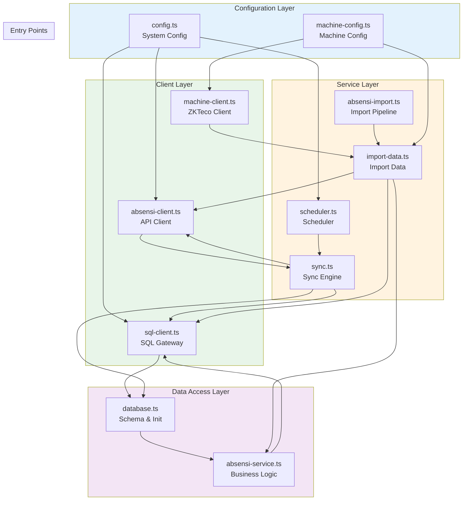
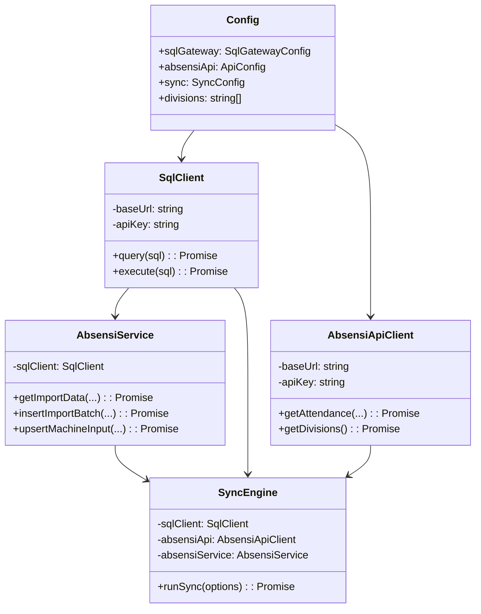

# 04_MODULE_DEPENDENCIES.md

# Module Dependencies Architecture

## Dependency Graph Overview



## Module Dependency Matrix

| Module | Depends On | Used By | Purpose |
|--------|------------|---------|---------|
| `config.ts` | None | All modules | Central configuration |
| `machine-config.ts` | None | Clients, Sync | Machine mapping |
| `sql-client.ts` | `config.ts` | Services, Sync | Database access |
| `absensi-client.ts` | `config.ts` | Sync, Import | API access |
| `machine-client.ts` | `machine-config.ts` | Import | ZKTeco access |
| `database.ts` | `sql-client.ts` | Init | Schema management |
| `absensi-service.ts` | `sql-client.ts` | Import | Business logic |
| `sync.ts` | `config`, `sql-client`, `absensi-client`, `database` | Scheduler | Main sync |
| `scheduler.ts` | `config.ts`, `sync.ts` | Entry point | Scheduling |
| `absensi-import.ts` | `config`, `sql-client`, `absensi-client` | Entry point | Import |
| `import-data.ts` | All services | Entry point | Data import |

## Detailed Module Analysis

### 1. Configuration Layer

#### config.ts
```
Purpose: Central configuration management
Dependencies: None
Exports: config object with:
  - sqlGateway: database connection settings
  - absensiApi: API connection settings
  - sync: interval, batch size, modes
  - divisions: list of divisions to sync
```

#### machine-config.ts
```
Purpose: Machine configuration and ID mapping
Dependencies: None
Exports:
  - machineServers: Map of 15 machines
  - scannerCodeMap: Suffix to code mapping
  - locCodeMap: Division to location code
  - getAllMachines(): Get all machine configs
  - getMachineByDivision(div): Find machine
  - getDivisionFromMachineId(id): Parse ID
  - convertMachineIdToEmpCode(id, div): Convert
```

### 2. Client Layer

#### sql-client.ts
```
Purpose: SQL Gateway HTTP client
Dependencies: config.ts
Exports: sqlClient singleton

Methods:
  - query(sql): Execute SELECT query
  - execute(sql): Execute INSERT/UPDATE/DELETE
  - getTables(): List all tables
  - tableExists(name): Check table existence
  - getTableSchema(name): Get column info

Internal Flow:
  POST { baseUrl } 
  Headers: { "x-api-key": apiKey }
  Body: { sql, db, server }
  Response: { success, data }
```

#### absensi-client.ts
```
Purpose: IT Solution API client
Dependencies: config.ts
Exports: absensiApi singleton

Methods:
  - getDivisions(): Get all divisions
  - getAvailableMonths(div): Get available months
  - getAttendance(div, month, year, mode): Get data
  - getLatestAttendance(mode): Get all divisions latest

Internal Flow:
  GET { baseUrl }{endpoint}?{params}
  Headers: { "x-api-key": apiKey }
  Response: { success, data }
```

#### machine-client.ts
```
Purpose: ZKTeco machine communication
Dependencies: machine-config.ts
Exports:
  - getAttendanceFromMachine(config): Get logs
  - getUsersFromMachine(config): Get users

ZKTeco Pattern:
  1. Create ZKLib instance
  2. createSocket()
  3. disableDevice() - prevent new records
  4. getAttendances() / getUsers()
  5. enableDevice()
  6. disconnect()
```

### 3. Service Layer

#### database.ts
```
Purpose: Database schema management
Dependencies: sql-client.ts
Exports:
  - createTables(): Create all tables
  - initConfig(): Insert default configs
  - resetTables(): Drop and recreate

Tables Created:
  - absen_import
  - absen_machine_input
  - absen_import_batch
  - absen_change_log
  - absen_config
  - absen_sync_log
```

#### absensi-service.ts
```
Purpose: Business logic for attendance data
Dependencies: sql-client.ts
Exports: absensiService singleton

Data Operations:
  IMPORT (Immutable):
    - getImportData(div, year, month)
    - getImportByEmployee(emp, div, year, month)
    - insertImportBatch(records, ...)

  MACHINE INPUT (Mutable):
    - getMachineInputData(div, year, month)
    - upsertMachineInput(record)
    - deleteMachineInput(emp, div, year, month, day)

  VERIFICATION (Combined):
    - getVerificationData(div, year, month)
    - getChangeLog(emp?, div?, year?, month?)
    - getStats(div, year, month)
```

#### sync.ts
```
Purpose: Main synchronization engine
Dependencies: All clients and services
Exports: runSync(options)

Flow:
  1. createTables() + initConfig()
  2. For each division:
     a. GetAvailableMonths
     b. For each month:
        - GetAttendance from API
        - MERGE into absen_master (or insertImportBatch)
        - Log sync result
  3. Log overall sync status

Options:
  - division: specific division
  - year, month: specific period
  - mode: "hk" or "ot"
```

#### scheduler.ts
```
Purpose: Automated sync scheduling
Dependencies: config.ts, sync.ts
Exports: None (runs on import)

Pattern:
  - Uses setInterval for scheduling
  - Initial sync on startup
  - Subsequent syncs every N minutes
  - Prevents concurrent syncs

Cron Equivalent:
  */{intervalMinutes} * * * *
```

### 4. Entry Points

#### absensi-import.ts
```
Purpose: CLI for data import
Dependencies: config, absensi-client, sql-client
Entry: node absensi-import.ts --division X --year Y --month Z

Features:
  - Batch ID generation
  - Progress logging
  - Error tracking per record
  - Batch status updates
```

#### import-data.ts
```
Purpose: Alternative import pipeline
Dependencies: All services
Entry: node import-data.ts [options]

Features:
  - Uses absensiService for business logic
  - Parses API data format
  - Inserts to absen_import
  - Shows statistics
```

## Dependency Injection Pattern



## Import Chain

```
User Command
    │
    ▼
absensi-import.ts (Entry)
    │
    ├──► config.ts (Settings)
    │
    ├──► absensi-client.ts (Fetch)
    │         │
    │         └──► IT Solution API
    │
    ├──► sql-client.ts (Database)
    │         │
    │         └──► SQL Gateway ──► SQL Server
    │
    └──► absen_import (Target Table)
```

## Test Files Dependency

| Test File | Tests | Mock Dependencies |
|-----------|-------|-------------------|
| `test-zklib-methods.ts` | ZKTeco client | None |
| `test-config.ts` | Configuration | config.ts |
| `test-service-sql.ts` | Service layer | sql-client.ts |
| `test-api-routes.ts` | API client | absensi-client.ts |
| `test-all-machines.mjs` | All machines | machine-config.ts |