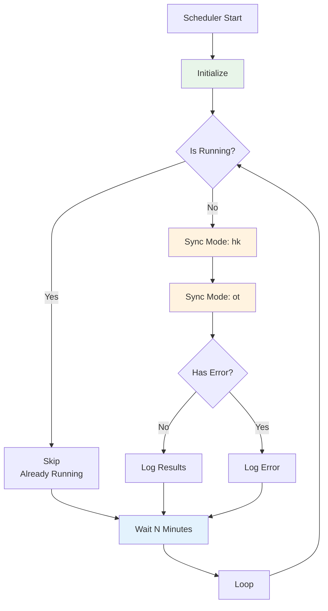
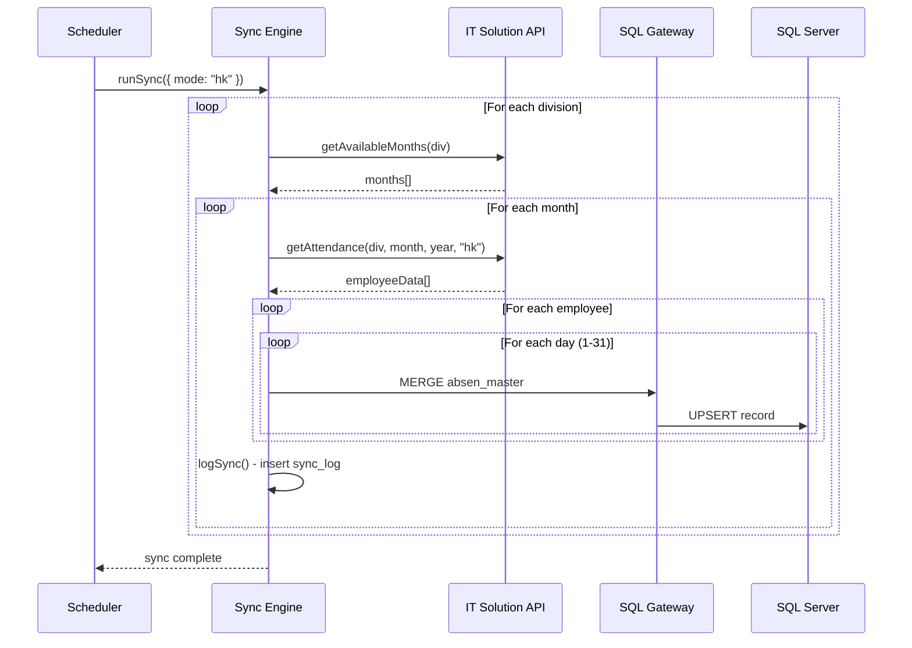
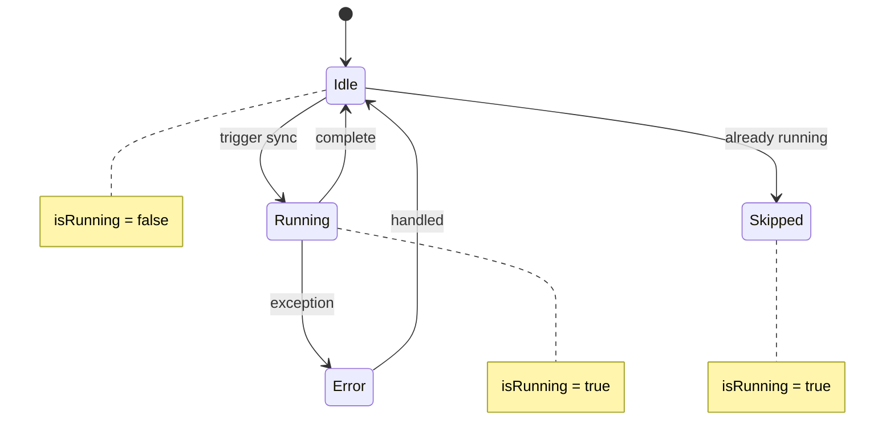

# 05_SYNC_SCHEDULER.md

# Sync Scheduler Implementation

## Overview

The scheduler provides automated, periodic synchronization of attendance data from both data sources to the central database. It runs every 15 minutes (configurable) and handles both working days (hk) and overtime (ot) modes.



## Scheduler Implementation

### From scheduler.ts

```typescript
// Parse interval from config
const intervalMinutes = config.sync.intervalMinutes || 15;
const intervalCron = `*/${intervalMinutes} * * * *`;

let isRunning = false;
let lastSyncTime: Date | null = null;

async function runScheduledSync() {
  // Prevent concurrent runs
  if (isRunning) {
    console.log("⏳ Sync already running, skipping...");
    return;
  }

  isRunning = true;
  lastSyncTime = new Date();

  console.log(`\n🕐 [${lastSyncTime.toISOString()}] Starting scheduled sync...`);

  try {
    // Sync for all modes (hk and ot)
    for (const mode of config.sync.modes) {
      console.log(`\n📊 Syncing mode: ${mode}`);
      await runSync({ mode: mode as "hk" | "ot" });
    }

    console.log(`\n✅ [${new Date().toISOString()}] Scheduled sync completed!`);
  } catch (error: any) {
    console.error(`\n❌ [${new Date().toISOString()}] Scheduled sync failed:`, error.message);
  } finally {
    isRunning = false;
  }
}

// Initial sync
runScheduledSync();

// Schedule subsequent syncs
setInterval(runScheduledSync, intervalMinutes * 60 * 1000);
```

## Cron Expression

The scheduler uses a cron-like interval pattern:

```
*/15 * * * *  (Every 15 minutes)
```

### Configuration

```typescript
// From config.ts
sync: {
  intervalMinutes: 15,  // Can be changed
  batchSize: 100,       // Records per batch
  modes: ["hk", "ot"],  // Both working and overtime
},
```

## Sync Modes

### Mode: hk (Hari Kerja - Working Days)

Syncs regular attendance data for working days:
- Normal work days
- Sundays (if worked)
- Holidays (if worked)
- Leave (cuti) tracking
- Sick leave (sakit) tracking

### Mode: ot (Overtime - Lembur)

Syncs overtime attendance data:
- Overtime hours per day
- Overtime task codes
- OT day identification

## Sync Process Flow



## Scheduler State Machine



## Sync Log Entries

Every sync operation creates a log entry:

```sql
INSERT INTO absen_sync_log (
  division, year, month, mode,
  records_synced, status, error_message, duration_ms
)
```

### Status Values

| Status | Meaning |
|--------|---------|
| `SUCCESS` | Sync completed without errors |
| `FAILED` | Sync failed with exception |
| `PARTIAL` | Some divisions failed |

### Log Query

```typescript
// From sync.ts
async function logSync(
  division: string | null,
  year: number | null,
  month: number | null,
  mode: string | null,
  recordsSynced: number,
  status: string,
  errorMessage: string | null,
  durationMs: number
): Promise<void> {
  const sql = `
    INSERT INTO absen_sync_log 
      (division, year, month, mode, records_synced, status, error_message, duration_ms)
    VALUES (
      ${division ? `'${division}'` : 'NULL'},
      ${year || 'NULL'},
      ${month || 'NULL'},
      ${mode ? `'${mode}'` : 'NULL'},
      ${recordsSynced},
      '${status}',
      ${errorMessage ? `'${errorMessage.replace(/'/g, "''")}'` : 'NULL'},
      ${durationMs}
    )
  `;
  
  await sqlClient.execute(sql);
}
```

## Error Handling

### Concurrent Sync Prevention

```typescript
let isRunning = false;

async function runScheduledSync() {
  if (isRunning) {
    console.log("⏳ Sync already running, skipping...");
    return;
  }
  
  isRunning = true;
  try {
    // ... sync logic
  } finally {
    isRunning = false;
  }
}
```

### Division-Level Error Handling

```typescript
for (const division of divisions) {
  try {
    const months = await absensiApi.getAvailableMonths(division);
    // ... sync each month
  } catch (e: any) {
    console.error(`❌ Error syncing division ${division}:`, e.message);
    // Continue with next division
  }
}
```

### Record-Level Error Handling

```typescript
for (const row of attendanceData) {
  try {
    await sqlClient.execute(sql);
    syncedCount++;
  } catch (e) {
    console.error(`  ❌ Error syncing ${empCode} day ${day}:`, e.message);
    // Continue with next record
  }
}
```

## Configuration Options

### Interval Options

| Interval | Use Case |
|----------|----------|
| 5 minutes | High-frequency sync needs |
| 15 minutes | Standard production (default) |
| 30 minutes | Low-bandwidth connections |
| 60 minutes | Daily reconciliation |

### Batch Size Options

| Batch Size | Memory Usage | DB Pressure |
|------------|-------------|------------|
| 50 | Low | High frequency |
| 100 | Medium | Balanced (default) |
| 200 | High | Low frequency |

## Monitoring

### Sync Status Check

```sql
-- Check recent sync activity
SELECT TOP 10 
  sync_date,
  division,
  records_synced,
  status,
  duration_ms
FROM absen_sync_log
ORDER BY sync_date DESC;

-- Check failed syncs
SELECT * FROM absen_sync_log
WHERE status = 'FAILED'
ORDER BY sync_date DESC;

-- Check sync frequency by division
SELECT 
  division,
  COUNT(*) as sync_count,
  SUM(records_synced) as total_records,
  AVG(duration_ms) as avg_duration
FROM absen_sync_log
GROUP BY division;
```

### Last Sync Check

```sql
-- Check last sync per division
SELECT 
  division,
  MAX(sync_date) as last_sync,
  status
FROM absen_sync_log
GROUP BY division, status;
```