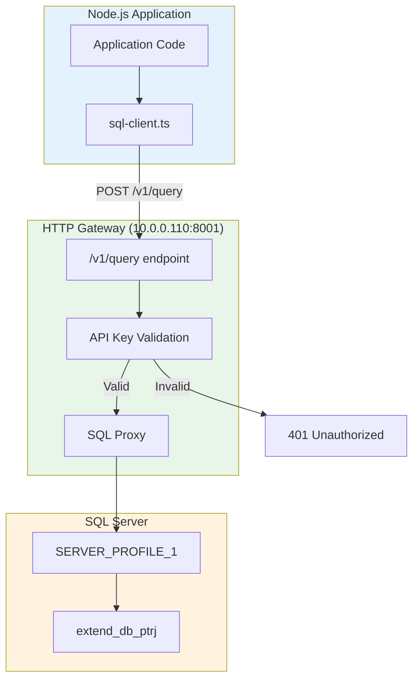

# 06_SQL_GATEWAY_PATTERN.md

# HTTP Gateway Architecture Pattern

## Overview

The system uses an HTTP Gateway pattern instead of direct SQL Server connections. This architectural decision provides security, simplicity, and centralized database access control.

## Why HTTP Gateway?

### Traditional Direct Connection

```
Node.js App ──────► SQL Server (Direct TCP 1433)
                  Requires:
                  - SQL Driver
                  - Connection String
                  - Network exposure
                  - Firewall rules
```

### HTTP Gateway Pattern

```
Node.js App ──────► HTTP Gateway ──────► SQL Server
                  (10.0.0.110:8001)      (Internal only)
                  
                  Benefits:
                  - Single HTTP endpoint
                  - API key authentication
                  - No direct DB exposure
                  - Firewall friendly
```

## Gateway Configuration

### From config.ts

```typescript
sqlGateway: {
  baseUrl: "http://10.0.0.110:8001/v1/query",
  apiKey: "<API_KEY>",
  server: "SERVER_PROFILE_1",
  database: "extend_db_ptrj",
},
```

### From sql-client.ts

```typescript
export class SqlClient {
  private baseUrl: string;
  private apiKey: string;
  private server: string;
  private database: string;

  constructor() {
    this.baseUrl = config.sqlGateway.baseUrl;
    this.apiKey = config.sqlGateway.apiKey;
    this.server = config.sqlGateway.server || "SERVER_PROFILE_1";
    this.database = config.sqlGateway.database || "extend_db_ptrj";
  }

  async query<T = any>(sql: string): Promise<T> {
    const response = await fetch(this.baseUrl, {
      method: "POST",
      headers: {
        "Content-Type": "application/json",
        "x-api-key": this.apiKey,
      },
      body: JSON.stringify({
        sql,
        db: this.database,
        server: this.server,
      }),
    });

    if (!response.ok) {
      throw new Error(`HTTP Error: ${response.status}`);
    }

    const result = await response.json();

    if (!result.success) {
      throw new Error(result.error || "Query failed");
    }

    return result.data;
  }
}
```

## Gateway Request/Response

### Request Format

```json
POST /v1/query
Headers:
  Content-Type: application/json
  x-api-key: {api_key}

Body:
{
  "sql": "SELECT * FROM absen_import WHERE division = 'PG1A'",
  "server": "SERVER_PROFILE_1",
  "db": "extend_db_ptrj"
}
```

### Response Format

```json
// Success
{
  "success": true,
  "data": {
    "recordset": [...],
    "rowsAffected": 10
  }
}

// Error
{
  "success": false,
  "error": "Invalid SQL syntax"
}
```

## Architecture Diagram



## Gateway Operations

### 1. Query (SELECT)

```typescript
async function getImportData(division: string) {
  const sql = `
    SELECT * FROM absen_import
    WHERE division = '${division}'
    ORDER BY tahun, bulan, hari
  `;
  
  const result = await sqlClient.query(sql);
  return result?.recordset || [];
}
```

### 2. Execute (INSERT/UPDATE/DELETE)

```typescript
async function insertRecord(record: any) {
  const sql = `
    INSERT INTO absen_import (
      emp_code, division, tahun, bulan, hari, has_work,
      attendance_date, import_batch_id, source
    ) VALUES (
      '${record.emp_code}', '${record.division}',
      ${record.tahun}, ${record.bulan}, ${record.hari},
      ${record.has_work ? 1 : 0},
      '${record.attendance_date}',
      '${record.batchId}',
      'MACHINE'
    )
  `;
  
  await sqlClient.execute(sql);
}
```

### 3. Table Metadata

```typescript
async function getTables(): Promise<string[]> {
  const result = await sqlClient.query(
    `SELECT table_name 
     FROM information_schema.tables 
     WHERE table_type = 'BASE TABLE' 
     AND table_schema = 'dbo'`
  );
  return result?.recordset?.map((row: any) => row.table_name) || [];
}

async function tableExists(tableName: string): Promise<boolean> {
  const result = await sqlClient.query(
    `SELECT COUNT(*) as count 
     FROM information_schema.tables 
     WHERE table_name = '${tableName}' 
     AND table_schema = 'dbo'`
  );
  return result?.recordset?.[0]?.count > 0;
}
```

## Security Benefits

### 1. No Direct Database Exposure

```
Traditional:
  Node.js ──► Port 1433 ──► SQL Server (Internet exposed)

Gateway:
  Node.js ──► Port 8001 ──► SQL Server (Internal only)
              (HTTP only, firewall controlled)
```

### 2. API Key Authentication

```typescript
// Every request requires API key
headers: {
  "x-api-key": config.sqlGateway.apiKey,
}
```

### 3. Centralized Access Control

- Single entry point for all database access
- Audit logging possible at gateway level
- Rate limiting potential
- Query validation possible

## Performance Characteristics

### Latency

```
Direct SQL (theoretical): ~5-10ms
HTTP Gateway:             ~10-30ms (adds HTTP overhead)

Network:                  ~20ms (to 10.0.0.110)
Gateway processing:       ~5-10ms
Total:                    ~30-50ms per query
```

### Throughput

- Gateway adds ~10-20ms per request
- Connection pooling not available (stateless HTTP)
- Batch operations reduce per-record overhead

### Optimization: Batching

```typescript
// Instead of individual inserts:
for (const record of records) {
  await sqlClient.execute(`INSERT INTO table VALUES (...)`);
}

// Use batch inserts with delays:
for (let i = 0; i < records.length; i++) {
  await sqlClient.execute(insertSQL);
  
  if (i % 20 === 0) {
    await new Promise(r => setTimeout(r, 200));
  }
}
```

## Error Handling

### HTTP Error Codes

| Code | Meaning | Action |
|------|---------|--------|
| 200 | Success | Process result |
| 400 | Bad Request | Check SQL syntax |
| 401 | Unauthorized | Check API key |
| 403 | Forbidden | Check permissions |
| 500 | Server Error | Retry with backoff |

### Application-Level Errors

```typescript
async query<T>(sql: string): Promise<T> {
  const response = await fetch(this.baseUrl, {
    method: "POST",
    headers: { ... },
    body: JSON.stringify({ sql, db: this.database, server: this.server }),
  });

  // Check HTTP status
  if (!response.ok) {
    throw new Error(`HTTP Error: ${response.status} ${response.statusText}`);
  }

  const result = await response.json();

  // Check application-level error
  if (!result.success) {
    throw new Error(result.error || "Query failed");
  }

  return result.data;
}
```

## Connection Retry Pattern

```typescript
async function queryWithRetry(sql: string, maxRetries = 3): Promise<any> {
  for (let attempt = 1; attempt <= maxRetries; attempt++) {
    try {
      return await query(sql);
    } catch (error) {
      if (attempt === maxRetries) throw error;
      
      console.log(`Retry ${attempt}/${maxRetries} in ${attempt * 1000}ms...`);
      await new Promise(r => setTimeout(r, attempt * 1000));
    }
  }
}
```

## Gateway vs Direct mssql

### Using mssql (Direct Connection)

```typescript
import mssql from 'mssql';

const pool = new mssql.ConnectionPool({
  server: '10.0.0.110',
  database: 'extend_db_ptrj',
  user: 'username',
  password: 'password',
  port: 1433
});

await pool.connect();
await pool.query('SELECT * FROM table');
```

### Using HTTP Gateway (Current)

```typescript
// No driver needed, just fetch
const result = await fetch('http://10.0.0.110:8001/v1/query', {
  method: 'POST',
  headers: { 'x-api-key': '...' },
  body: JSON.stringify({ sql: 'SELECT * FROM table', ... })
});
```

### Comparison

| Aspect | mssql Direct | HTTP Gateway |
|--------|--------------|--------------|
| Dependencies | mssql driver | None (native fetch) |
| Connection Pool | Yes | No (stateless) |
| Firewall | Port 1433 | Port 8001 only |
| Security | SQL auth | API key |
| Setup | Complex | Simple |
| Debugging | Native errors | JSON responses |