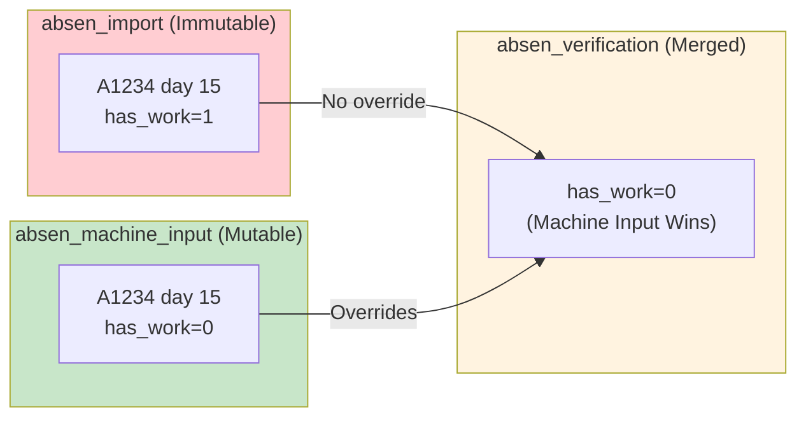
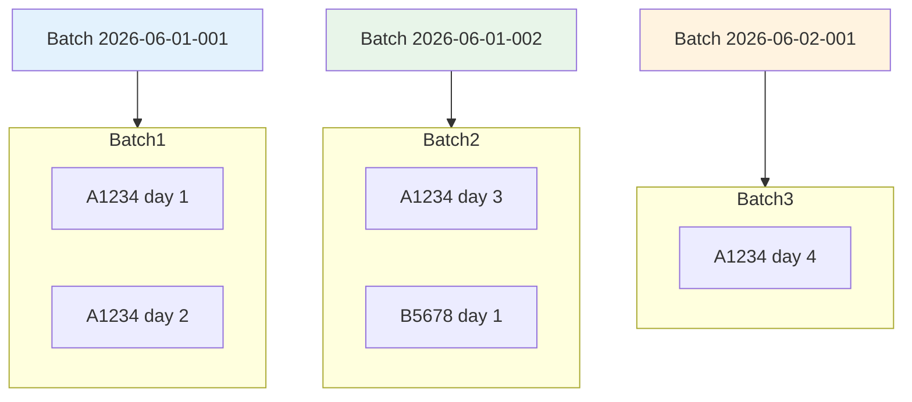

# 07_IMMUTABILITY_ARCHITECTURE.md

# Data Immutability Architecture

## Core Principle

The system enforces a strict immutability policy for raw attendance data to ensure data integrity, auditability, and reproducibility of historical records.

```
┌─────────────────────────────────────────────────────────────────────┐
│                    DATA MUTABILITY SPECTRUM                         │
├─────────────────────────────────────────────────────────────────────┤
│                                                                     │
│  IMMUTABLE                    │              MUTABLE                │
│  (Cannot change)              │              (Can change)            │
│                               │                                     │
│  ┌─────────────────┐          │    ┌─────────────────┐             │
│  │ absen_import     │          │    │ absen_machine_   │             │
│  │ (Raw from        │◄──────────│    │ input           │             │
│  │  machines/API)   │          │    │ (Manual          │             │
│  └─────────────────┘          │    │  corrections)   │             │
│         │                      │    └────────┬─────────┘             │
│         │ Locked               │             │                      │
│         ▼                      │             │ Overrides            │
│  is_locked = 1                  │             ▼                      │
│                               │    ┌─────────────────┐             │
│                               │    │ absen_verification │          │
│                               │    │ (Merged view)     │          │
│                               │    └─────────────────┘             │
│                                                                     │
└─────────────────────────────────────────────────────────────────────┘
```

## Why Immutability?

### 1. Audit Trail Integrity

- Original data never changes
- Can always trace back to source
- Reproduce any historical report

### 2. Error Recovery

- Mistakes in processing don't destroy raw data
- Can re-process from original import
- Batch-based rollback possible

### 3. Compliance

- Maintain data integrity for labor law compliance
- Prove attendance records haven't been tampered
- Support dispute resolution with verifiable data

### 4. Reproducibility

- Same input always produces same output
- Recalculate reports from immutable base
- Debug processing issues easily

## Data Tables Architecture

### Table 1: absen_import (IMMUTABLE)

```sql
CREATE TABLE absen_import (
  id INT IDENTITY(1,1) PRIMARY KEY,
  emp_code NVARCHAR(50) NOT NULL,
  emp_name NVARCHAR(255),
  gang_code NVARCHAR(50),
  division NVARCHAR(50) NOT NULL,
  year INT NOT NULL,
  month INT NOT NULL,
  day INT NOT NULL,
  has_work BIT DEFAULT 0,
  is_sunday BIT DEFAULT 0,
  is_holiday BIT DEFAULT 0,
  holiday_desc NVARCHAR(255),
  is_cuti BIT DEFAULT 0,
  is_sakit BIT DEFAULT 0,
  task_code NVARCHAR(50),
  ot_hours DECIMAL(5,2) DEFAULT 0,
  attendance_date DATE NOT NULL,
  import_batch_id NVARCHAR(100),
  imported_at DATETIME DEFAULT GETDATE(),
  source NVARCHAR(50) DEFAULT 'MACHINE',
  is_locked BIT DEFAULT 1,
  UNIQUE (emp_code, division, year, month, day, import_batch_id)
);
```

**Key Characteristics:**
- `is_locked BIT DEFAULT 1` - Flag to prevent edits
- `import_batch_id` - Links to source batch
- `imported_at` - Timestamp of import
- `source` - MACHINE or API origin

### Table 2: absen_machine_input (MUTABLE)

```sql
CREATE TABLE absen_machine_input (
  id INT IDENTITY(1,1) PRIMARY KEY,
  emp_code NVARCHAR(50) NOT NULL,
  emp_name NVARCHAR(255),
  gang_code NVARCHAR(50),
  division NVARCHAR(50) NOT NULL,
  year INT NOT NULL,
  month INT NOT NULL,
  day INT NOT NULL,
  -- ... same fields ...
  input_type NVARCHAR(20) DEFAULT 'MANUAL',
  created_at DATETIME DEFAULT GETDATE(),
  updated_at DATETIME DEFAULT GETDATE(),
  created_by NVARCHAR(100),
  notes NVARCHAR(500),
  UNIQUE (emp_code, division, year, month, day)
);
```

**Key Characteristics:**
- No `is_locked` flag
- `updated_at` column for tracking changes
- `created_by` for accountability
- `notes` for explanation of changes

## Immutability Enforcement

### 1. No UPDATE/DELETE on absen_import

```typescript
// WRONG - Never do this
await sqlClient.execute(`
  UPDATE absen_import 
  SET has_work = 0 
  WHERE emp_code = 'A1234' AND day = 15
`);

// CORRECT - Use machine_input instead
await absensiService.upsertMachineInput({
  emp_code: 'A1234',
  day: 15,
  has_work: false,
  // ... other fields
});
```

### 2. Batch Insert Only

```typescript
// From absensi-service.ts
async insertImportBatch(
  records: Omit<AbsenRecord, "id" | "created_at">[],
  division: string,
  year: number,
  month: number,
  importedBy: string = "SYSTEM"
): Promise<number> {
  const batchId = uuidv4();

  // Insert batch record first
  await sqlClient.execute(`
    INSERT INTO absen_import_batch 
      (batch_id, division, year, month, total_records, status, imported_by)
    VALUES 
      ('${batchId}', '${division}', ${year}, ${month}, ${records.length}, 'IN_PROGRESS', '${importedBy}')
  `);

  // Insert records only (no updates)
  for (const record of records) {
    await sqlClient.execute(`
      INSERT INTO absen_import (
        emp_code, emp_name, division, year, month, day,
        has_work, import_batch_id, source, is_locked
      ) VALUES (
        '${record.emp_code}',
        '${record.division}',
        ${record.year},
        ${record.month},
        ${record.day},
        ${record.has_work ? 1 : 0},
        '${batchId}',
        'MACHINE',
        1
      )
    `);
  }

  return records.length;
}
```

## Merge Strategy (Verification View)



### Priority Rules

```
If machine_input exists:
  USE machine_input values
Else:
  USE import values
```

### SQL Merge Query

```sql
SELECT
  COALESCE(m.emp_code, i.emp_code) as emp_code,
  COALESCE(m.division, i.division) as division,
  COALESCE(m.year, i.year) as year,
  COALESCE(m.month, i.month) as month,
  COALESCE(m.day, i.day) as day,

  -- Machine input takes priority
  COALESCE(m.has_work, i.has_work) as has_work,
  COALESCE(m.is_sunday, i.is_sunday) as is_sunday,
  COALESCE(m.is_holiday, i.is_holiday) as is_holiday,
  COALESCE(m.is_cuti, i.is_cuti) as is_cuti,
  COALESCE(m.is_sakit, i.is_sakit) as is_sakit,
  COALESCE(m.ot_hours, i.ot_hours) as ot_hours,

  -- Metadata
  i.id as import_id,
  m.id as machine_input_id,
  CASE WHEN m.id IS NOT NULL THEN 'MACHINE_INPUT'
       WHEN i.id IS NOT NULL THEN 'IMPORT'
       ELSE 'NONE' END as source,

  -- Conflict detection
  CASE WHEN m.id IS NOT NULL AND i.id IS NOT NULL
       AND m.has_work <> i.has_work THEN 1
       ELSE 0 END as has_conflict

FROM absen_import i
FULL OUTER JOIN absen_machine_input m
  ON i.emp_code = m.emp_code
  AND i.division = m.division
  AND i.year = m.year
  AND i.month = m.month
  AND i.day = m.day

WHERE COALESCE(i.division, m.division) = 'PG1A'
  AND COALESCE(i.year, m.year) = 2026
  AND COALESCE(i.month, m.month) = 6
```

## Change Audit Trail

Every mutation is logged in `absen_change_log`:

```sql
CREATE TABLE absen_change_log (
  id INT IDENTITY(1,1) PRIMARY KEY,
  emp_code NVARCHAR(50) NOT NULL,
  division NVARCHAR(50) NOT NULL,
  year INT NOT NULL,
  month INT NOT NULL,
  day INT NOT NULL,
  field_name NVARCHAR(50),
  old_value NVARCHAR(MAX),
  new_value NVARCHAR(MAX),
  change_type NVARCHAR(20) NOT NULL,  -- ADD, EDIT, DELETE
  source_table NVARCHAR(50),
  changed_by NVARCHAR(100),
  changed_at DATETIME DEFAULT GETDATE()
);
```

### Change Logging Implementation

```typescript
// From absensi-service.ts
private async logChange(
  newRecord: any,
  oldRecord: any,
  changeType: "ADD" | "EDIT" | "DELETE",
  sourceTable: string,
  changedBy?: string
): Promise<void> {
  const fields = [
    "has_work", "is_sunday", "is_holiday", "holiday_desc",
    "is_cuti", "is_sakit", "task_code", "ot_hours"
  ];

  for (const field of fields) {
    const oldValue = oldRecord?.[field];
    const newValue = newRecord[field];

    if (oldValue !== newValue) {
      await sqlClient.execute(`
        INSERT INTO absen_change_log (
          emp_code, division, year, month, day,
          field_name, old_value, new_value,
          change_type, source_table, changed_by
        ) VALUES (
          '${newRecord.emp_code}',
          '${newRecord.division}',
          ${newRecord.year},
          ${newRecord.month},
          ${newRecord.day},
          '${field}',
          ${oldValue !== undefined ? `'${oldValue}'` : 'NULL'},
          ${newValue !== undefined ? `'${newValue}'` : 'NULL'},
          '${changeType}',
          '${sourceTable}',
          ${changedBy ? `'${changedBy}'` : 'NULL'}
        )
      `);
    }
  }
}
```

## Batch-Based Immutability

Each import creates a new batch:



### Batch Tracking Table

```sql
CREATE TABLE absen_import_batch (
  id INT IDENTITY(1,1) PRIMARY KEY,
  batch_id NVARCHAR(100) UNIQUE NOT NULL,
  division NVARCHAR(50) NOT NULL,
  year INT NOT NULL,
  month INT NOT NULL,
  total_records INT DEFAULT 0,
  imported_records INT DEFAULT 0,
  status NVARCHAR(50) DEFAULT 'PENDING',
  import_started_at DATETIME DEFAULT GETDATE(),
  import_completed_at DATETIME,
  error_message NVARCHAR(MAX),
  imported_by NVARCHAR(100) DEFAULT 'SYSTEM'
);
```

### Batch Status Flow

```
PENDING ──────► IN_PROGRESS ──────► COMPLETED
                    │                    │
                    │                    │
                    └──► COMPLETED_WITH_ERRORS
```

## Recovery Scenarios

### Scenario 1: Wrong Data Imported

```
Problem: Batch 2026-06-01-001 has wrong data
Solution: 
  1. SELECT * FROM absen_import WHERE import_batch_id = '2026-06-01-001'
  2. DELETE FROM absen_import WHERE import_batch_id = '2026-06-01-001'
  3. Re-import with corrected source data
  4. Original batch still tracked in absen_import_batch
```

### Scenario 2: Machine Input Error

```
Problem: User incorrectly set has_work = 0 for A1234 day 15
Solution:
  1. UPDATE absen_machine_input SET has_work = 1 WHERE emp_code = 'A1234' AND day = 15
  2. Change is logged in absen_change_log
  3. Verification view now shows correct value
```

### Scenario 3: Complete Rollback

```
Problem: Need to rollback entire day's import
Solution:
  1. SELECT * FROM absen_import WHERE attendance_date = '2026-06-15'
  2. DELETE FROM absen_import WHERE attendance_date = '2026-06-15'
  3. Original data still in source systems (API/ZKTeco)
  4. Re-import if needed
```