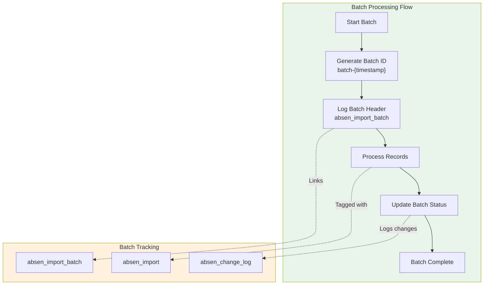
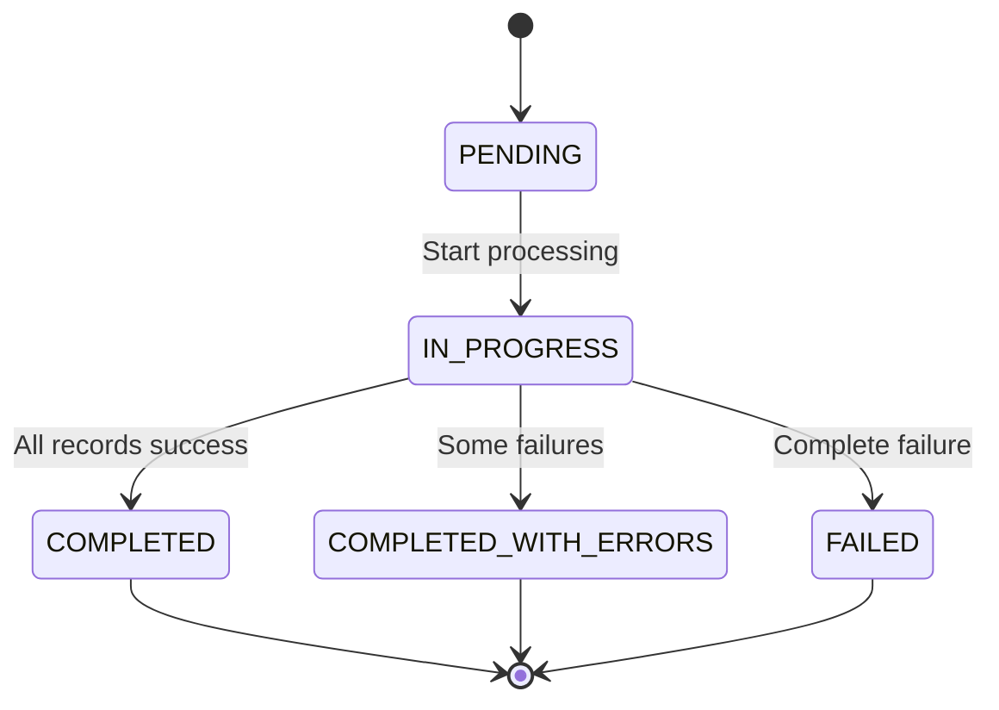
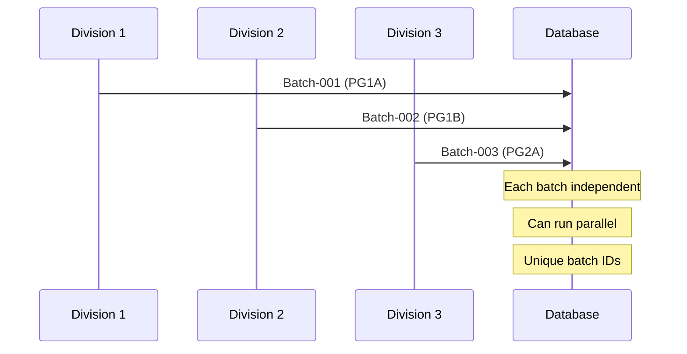

# 08_BATCH_PROCESSING.md

# Batch Processing Architecture

## Overview

Every import operation is tracked as a batch, enabling audit trails, retry capabilities, and reconciliation. The batch ID provides a unique identifier for each import session.



## Batch ID Generation

### From absensi-import.ts

```typescript
// Generate unique batch ID
const batchId = `batch-${Date.now()}`;

// Result: "batch-1750012345678"
```

### Batch ID Format

```
batch-{timestamp}
     │
     └── Unix timestamp in milliseconds
```

## Batch Header Creation

### Insert Batch Header

```typescript
// From absensi-import.ts
await query(`
  INSERT INTO absen_import_batch (
    batch_id, division, year, month, total_records, status, imported_by
  ) VALUES (
    '${batchId}', '${division}', ${year}, ${month}, ${records.length}, 
    'IN_PROGRESS', '${importedBy}'
  )
`);
```

### Batch Schema

```sql
CREATE TABLE absen_import_batch (
  id INT IDENTITY(1,1) PRIMARY KEY,
  batch_id NVARCHAR(100) UNIQUE NOT NULL,
  division NVARCHAR(50) NOT NULL,
  year INT NOT NULL,
  month INT NOT NULL,
  total_records INT DEFAULT 0,
  imported_records INT DEFAULT 0,
  status NVARCHAR(50) DEFAULT 'PENDING',
  import_started_at DATETIME DEFAULT GETDATE(),
  import_completed_at DATETIME,
  error_message NVARCHAR(MAX),
  imported_by NVARCHAR(100) DEFAULT 'SYSTEM'
);
```

## Batch Status Flow



### Status Definitions

| Status | Meaning | Action |
|--------|---------|--------|
| `PENDING` | Batch created, not started | System use only |
| `IN_PROGRESS` | Currently processing | Running |
| `COMPLETED` | All records imported successfully | Done |
| `COMPLETED_WITH_ERRORS` | Some records failed | Review errors |
| `FAILED` | Batch completely failed | Retry needed |

## Record Processing with Batch ID

### Each Record Tagged with Batch ID

```typescript
// From absensi-import.ts
for (const record of records) {
  const sql = `
    INSERT INTO absen_import (
      emp_code, division, year, month, day,
      has_work, attendance_date,
      import_batch_id, source, is_locked
    ) VALUES (
      '${record.emp_code}',
      '${record.division}',
      ${record.year},
      ${record.month},
      ${record.day},
      ${record.has_work ? 1 : 0},
      '${record.attendance_date}',
      '${batchId}',           -- Link to batch
      'MACHINE',
      1
    )
  `;

  try {
    await query(sql);
    inserted++;
  } catch (e: any) {
    errors.push(`${record.emp_code} day ${record.day}: ${e.message}`);
  }
}
```

## Batch Completion

### Update Batch Status

```typescript
// From absensi-import.ts
await query(`
  UPDATE absen_import_batch
  SET status = '${errors.length > 0 ? "COMPLETED_WITH_ERRORS" : "COMPLETED"}',
      imported_records = ${inserted},
      import_completed_at = GETDATE(),
      error_message = ${errors.length > 0 ? `'${errors.join("; ")}'` : 'NULL'}
  WHERE batch_id = '${batchId}'
`);
```

## Batch Query Examples

### Query All Batches

```sql
-- Get recent batches
SELECT 
  batch_id,
  division,
  year,
  month,
  total_records,
  imported_records,
  status,
  import_started_at,
  import_completed_at,
  imported_by
FROM absen_import_batch
ORDER BY import_started_at DESC;
```

### Query Batch Details

```sql
-- Get records for specific batch
SELECT 
  emp_code,
  division,
  year,
  month,
  day,
  has_work,
  attendance_date,
  imported_at
FROM absen_import
WHERE import_batch_id = 'batch-1750012345678'
ORDER BY emp_code, day;
```

### Query Failed Batches

```sql
-- Find batches with errors
SELECT 
  batch_id,
  division,
  imported_records,
  total_records,
  error_message
FROM absen_import_batch
WHERE status IN ('FAILED', 'COMPLETED_WITH_ERRORS')
ORDER BY import_started_at DESC;
```

## Retry Mechanism

### Retry Failed Batch

```typescript
async function retryBatch(batchId: string) {
  // 1. Get batch info
  const batch = await sqlClient.query(`
    SELECT * FROM absen_import_batch WHERE batch_id = '${batchId}'
  `);

  // 2. Check if already imported
  const existingCount = await sqlClient.query(`
    SELECT COUNT(*) as cnt FROM absen_import
    WHERE import_batch_id = '${batchId}'
  `);

  // 3. If partial import, get missing records
  if (existingCount < batch.total_records) {
    // Re-fetch from source
    // Re-insert missing records
  }

  // 4. Update batch status
  await sqlClient.execute(`
    UPDATE absen_import_batch
    SET status = 'COMPLETED',
        import_completed_at = GETDATE()
    WHERE batch_id = '${batchId}'
  `);
}
```

## Reconciliation

### Compare Batch Records

```sql
-- Find records in batch but missing in verification
SELECT 
  i.emp_code,
  i.division,
  i.year,
  i.month,
  i.day
FROM absen_import i
WHERE i.import_batch_id = 'batch-1750012345678'
AND NOT EXISTS (
  SELECT 1 FROM absen_verification v
  WHERE v.emp_code = i.emp_code
    AND v.division = i.division
    AND v.year = i.year
    AND v.month = i.month
    AND v.day = i.day
);
```

### Batch Statistics

```sql
-- Get batch statistics
SELECT 
  b.batch_id,
  b.division,
  b.year,
  b.month,
  b.total_records,
  b.imported_records,
  b.total_records - b.imported_records as failed_records,
  CASE 
    WHEN b.total_records = b.imported_records THEN 'Success'
    WHEN b.imported_records > 0 THEN 'Partial'
    ELSE 'Failed'
  END as status,
  DATEDIFF(SECOND, b.import_started_at, b.import_completed_at) as duration_sec
FROM absen_import_batch b
WHERE b.import_completed_at IS NOT NULL
ORDER BY b.import_started_at DESC;
```

## Performance Optimization

### Batch Size Configuration

```typescript
// From config.ts
sync: {
  batchSize: 100,  // Records per batch
},
```

### Delay Between Records

```typescript
// From absensi-import.ts
for (let i = 0; i < records.length; i++) {
  try {
    await query(sql);
    inserted++;

    // Small delay every 20 records to prevent gateway overload
    if (i > 0 && i % 20 === 0) {
      await new Promise((resolve) => setTimeout(resolve, 200));
    }
  } catch (e: any) {
    errors.push(`${r.emp_code} day ${r.hari}: ${e.message}`);
  }
}
```

## Multi-Batch Processing

### Process Multiple Divisions



### Parallel Batch Processing

```typescript
// From scheduler.ts
async function runScheduledSync() {
  // Process each division
  for (const division of divisions) {
    try {
      // Each division = new batch
      const count = await importFromApi(division, year, month);
    } catch (e: any) {
      // Division-level error handling
    }
  }
}
```

## Batch Audit Trail

### Batch History Query

```sql
-- Get complete batch history
SELECT 
  batch_id,
  division,
  year,
  month,
  imported_by,
  status,
  total_records,
  imported_records,
  error_message,
  import_started_at,
  import_completed_at
FROM absen_import_batch
WHERE division = 'PG1A'
  AND year = 2026
  AND month = 6
ORDER BY import_started_at DESC;
```

### Export Batch Data

```typescript
async function exportBatch(batchId: string) {
  // 1. Get batch info
  const batchInfo = await sqlClient.query(`
    SELECT * FROM absen_import_batch WHERE batch_id = '${batchId}'
  `);

  // 2. Get all records
  const records = await sqlClient.query(`
    SELECT * FROM absen_import WHERE import_batch_id = '${batchId}'
  `);

  // 3. Export to JSON
  return {
    batch: batchInfo.recordset[0],
    records: records.recordset
  };
}
```