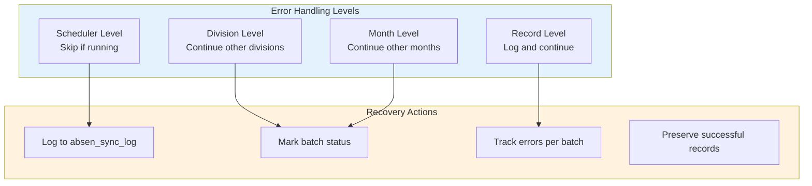
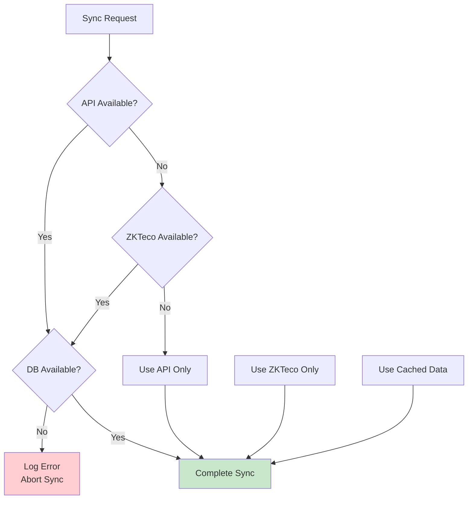

# 09_ERROR_RECOVERY.md

# Error Handling and Recovery

## Error Handling Strategy

The system implements multi-level error handling to ensure data integrity and operational continuity:



## Level 1: Scheduler-Level Error Handling

### Concurrent Sync Prevention

```typescript
// From scheduler.ts
let isRunning = false;

async function runScheduledSync() {
  // Prevent concurrent runs
  if (isRunning) {
    console.log("⏳ Sync already running, skipping...");
    return;
  }

  isRunning = true;
  try {
    // ... sync logic
  } finally {
    isRunning = false;
  }
}
```

### Scheduler Error Handling

```typescript
try {
  // Sync for all modes
  for (const mode of config.sync.modes) {
    await runSync({ mode: mode as "hk" | "ot" });
  }
} catch (error: any) {
  console.error(`\n❌ [${new Date().toISOString()}] Scheduled sync failed:`, error.message);
  // Scheduler continues - will retry next interval
}
```

## Level 2: Division-Level Error Handling

```typescript
// From sync.ts
for (const division of divisions) {
  try {
    const months = await absensiApi.getAvailableMonths(division);
    
    for (const { year, month } of months) {
      const count = await syncDivision(division, year, month, mode);
    }
  } catch (e: any) {
    // Log error but continue with next division
    console.error(`❌ Error syncing division ${division}:`, e.message);
    // Continue to next division
  }
}
```

## Level 3: Month-Level Error Handling

```typescript
// From sync.ts - syncDivision
async function syncDivision(division, year, month, mode) {
  const startTime = Date.now();

  try {
    const attendanceData = await absensiApi.getAttendance(division, month, year, mode);

    if (!attendanceData || attendanceData.length === 0) {
      console.log(`  ⚠️ No data for ${division}`);
      return 0;
    }

    let syncedCount = 0;

    // Process employees (with record-level error handling)
    for (const row of attendanceData) {
      try {
        // ... process each day
      } catch (e) {
        console.error(`  ❌ Error syncing ${empCode} day ${day}:`, e.message);
        // Continue with next day
      }
    }

    // Log successful sync
    const duration = Date.now() - startTime;
    await logSync(division, year, month, mode, syncedCount, "SUCCESS", null, duration);

    return syncedCount;

  } catch (error: any) {
    // Log failed sync
    const duration = Date.now() - startTime;
    await logSync(division, year, month, mode, 0, "FAILED", error.message, duration);
    throw error;
  }
}
```

## Level 4: Record-Level Error Handling

```typescript
// From absensi-import.ts
let inserted = 0;
const errors: string[] = [];

for (let i = 0; i < records.length; i++) {
  const r = records[i];

  const sql = `
    INSERT INTO absen_import (
      emp_code, division, year, month, day, has_work, attendance_date, ...
    ) VALUES (...)
  `;

  try {
    await query(sql);
    inserted++;
  } catch (e: any) {
    // Log error but continue processing
    errors.push(`${r.emp_code} day ${r.hari}: ${e.message}`);
  }
}

// Update batch status with error count
await query(`
  UPDATE absen_import_batch
  SET status = '${errors.length > 0 ? "COMPLETED_WITH_ERRORS" : "COMPLETED"}',
      imported_records = ${inserted},
      error_message = ${errors.length > 0 ? `'${errors.join("; ")}'` : 'NULL'}
  WHERE batch_id = '${batchId}'
`);
```

## Error Logging

### Sync Log Table

```sql
CREATE TABLE absen_sync_log (
  id INT IDENTITY(1,1) PRIMARY KEY,
  sync_date DATETIME DEFAULT GETDATE(),
  division NVARCHAR(50),
  year INT,
  month INT,
  mode NVARCHAR(10),
  records_synced INT DEFAULT 0,
  status NVARCHAR(50) DEFAULT 'SUCCESS',
  error_message NVARCHAR(MAX),
  duration_ms INT DEFAULT 0
);
```

### Logging Function

```typescript
// From sync.ts
async function logSync(
  division: string | null,
  year: number | null,
  month: number | null,
  mode: string | null,
  recordsSynced: number,
  status: string,
  errorMessage: string | null,
  durationMs: number
): Promise<void> {
  const sql = `
    INSERT INTO absen_sync_log (
      division, year, month, mode, records_synced, status, error_message, duration_ms
    ) VALUES (
      ${division ? `'${division}'` : 'NULL'},
      ${year || 'NULL'},
      ${month || 'NULL'},
      ${mode ? `'${mode}'` : 'NULL'},
      ${recordsSynced},
      '${status}',
      ${errorMessage ? `'${errorMessage.replace(/'/g, "''")}'` : 'NULL'},
      ${durationMs}
    )
  `;

  await sqlClient.execute(sql);
}
```

## Recovery Scenarios

### Scenario 1: Network Timeout

```
Problem: API request times out
Recovery:
  1. Error logged to sync_log with status "FAILED"
  2. Scheduler retries at next interval
  3. No partial data inserted
  4. Original API data still available
```

### Scenario 2: Partial Insert Failure

```
Problem: 5 records fail out of 100
Recovery:
  1. 95 records successfully inserted
  2. Batch status = "COMPLETED_WITH_ERRORS"
  3. Error details stored in batch.error_message
  4. Can retry failed records independently
```

### Scenario 3: Machine Unreachable

```
Problem: ZKTeco machine not accessible
Recovery:
  1. Error logged for specific machine
  2. Other machines continue syncing
  3. Data from API source as fallback
  4. Machine accessible later for catch-up
```

## Recovery Procedures

### 1. Retry Failed Batch

```typescript
async function retryBatch(batchId: string) {
  // Get batch info
  const batch = await sqlClient.query(`
    SELECT * FROM absen_import_batch WHERE batch_id = '${batchId}'
  `);

  if (!batch.recordset.length) {
    throw new Error(`Batch ${batchId} not found`);
  }

  // Check status
  if (batch.recordset[0].status === 'COMPLETED') {
    console.log('Batch already completed');
    return;
  }

  // Get division, year, month from batch
  const { division, year, month } = batch.recordset[0];

  // Re-fetch from API
  const apiData = await absensiApi.getAttendance(division, month, year, 'hk');

  // Re-insert records
  const records = convertApiToDbFormat(apiData, division, year, month, batchId);

  // Insert with same batch ID
  for (const record of records) {
    try {
      await sqlClient.execute(insertSQL);
    } catch (e) {
      // Skip already inserted records (unique constraint)
    }
  }

  // Update batch status
  await sqlClient.execute(`
    UPDATE absen_import_batch
    SET status = 'COMPLETED',
        import_completed_at = GETDATE()
    WHERE batch_id = '${batchId}'
  `);
}
```

### 2. Clear and Re-import

```typescript
async function clearAndReimport(division: string, year: number, month: number) {
  // 1. Delete existing records
  await sqlClient.execute(`
    DELETE FROM absen_import
    WHERE division = '${division}' AND year = ${year} AND month = ${month}
  `);

  // 2. Re-fetch from API
  const apiData = await absensiApi.getAttendance(division, month, year, 'hk');

  // 3. Re-insert with new batch
  const batchId = `batch-${Date.now()}`;
  const records = convertApiToDbFormat(apiData, division, year, month, batchId);

  for (const record of records) {
    await sqlClient.execute(insertSQL);
  }

  console.log(`Re-imported ${records.length} records for ${division}`);
}
```

### 3. Manual Correction via Machine Input

```typescript
async function manualCorrection(
  empCode: string,
  division: string,
  year: number,
  month: number,
  day: number,
  corrections: Partial<AbsenRecord>,
  changedBy: string
) {
  // Get existing record
  const existing = await sqlClient.query(`
    SELECT * FROM absen_machine_input
    WHERE emp_code = '${empCode}'
      AND division = '${division}'
      AND year = ${year}
      AND month = ${month}
      AND day = ${day}
  `);

  if (existing.recordset.length > 0) {
    // UPDATE existing machine input
    await sqlClient.execute(`
      UPDATE absen_machine_input SET
        has_work = ${corrections.has_work ? 1 : 0},
        is_sunday = ${corrections.is_sunday ? 1 : 0},
        is_holiday = ${corrections.is_holiday ? 1 : 0},
        is_cuti = ${corrections.is_cuti ? 1 : 0},
        is_sakit = ${corrections.is_sakit ? 1 : 0},
        ot_hours = ${corrections.ot_hours || 0},
        updated_at = GETDATE(),
        notes = '${corrections.notes || ''}'
      WHERE emp_code = '${empCode}' AND division = '${division}'
        AND year = ${year} AND month = ${month} AND day = ${day}
    `);
  } else {
    // INSERT new machine input
    await sqlClient.execute(`
      INSERT INTO absen_machine_input (
        emp_code, division, year, month, day,
        has_work, is_sunday, is_holiday, is_cuti, is_sakit, ot_hours,
        input_type, created_by, notes
      ) VALUES (
        '${empCode}', '${division}', ${year}, ${month}, ${day},
        ${corrections.has_work ? 1 : 0},
        ${corrections.is_sunday ? 1 : 0},
        ${corrections.is_holiday ? 1 : 0},
        ${corrections.is_cuti ? 1 : 0},
        ${corrections.is_sakit ? 1 : 0},
        ${corrections.ot_hours || 0},
        'MANUAL',
        '${changedBy}',
        '${corrections.notes || ''}'
      )
    `);
  }
}
```

## Error Monitoring Queries

### Recent Errors

```sql
-- Get recent sync errors
SELECT TOP 20
  sync_date,
  division,
  status,
  error_message,
  duration_ms
FROM absen_sync_log
WHERE status = 'FAILED'
ORDER BY sync_date DESC;
```

### Error Summary by Division

```sql
-- Error count by division
SELECT
  division,
  COUNT(*) as total_syncs,
  SUM(CASE WHEN status = 'FAILED' THEN 1 ELSE 0 END) as failures,
  AVG(duration_ms) as avg_duration
FROM absen_sync_log
WHERE sync_date > DATEADD(DAY, -7, GETDATE())
GROUP BY division
ORDER BY failures DESC;
```

### Batch Error Details

```sql
-- Get batch error details
SELECT
  batch_id,
  division,
  imported_records,
  total_records,
  total_records - imported_records as failed_count,
  error_message
FROM absen_import_batch
WHERE status = 'COMPLETED_WITH_ERRORS'
ORDER BY import_started_at DESC;
```

## Retry Configuration

```typescript
// Configuration for retry behavior
const retryConfig = {
  maxRetries: 3,
  baseDelay: 1000,  // 1 second
  maxDelay: 30000,  // 30 seconds
  backoffMultiplier: 2,
};

// Exponential backoff
function getRetryDelay(attempt: number): number {
  const delay = retryConfig.baseDelay * Math.pow(retryConfig.backoffMultiplier, attempt);
  return Math.min(delay, retryConfig.maxDelay);
}
```

## Graceful Degradation

