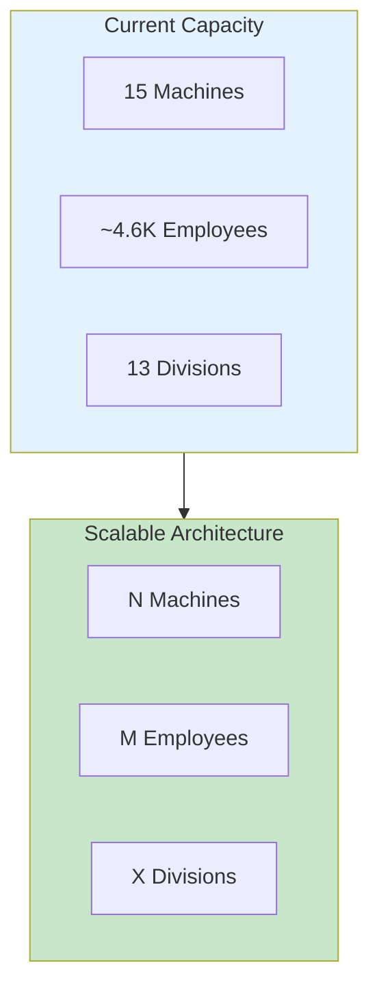
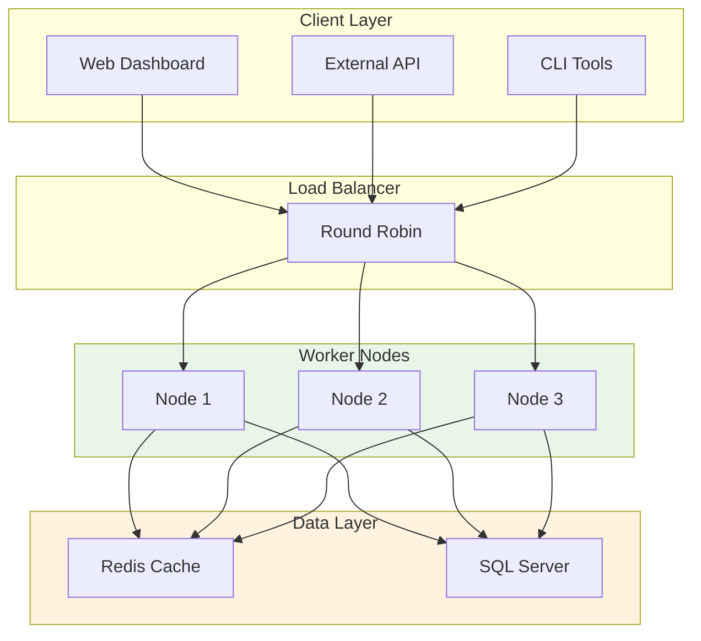

# 10_SCALABILITY_PATTERNS.md

# Scalability Patterns

## Overview

The system is designed to scale horizontally to handle:
- More attendance machines (currently 15, expandable)
- More employees per machine (currently ~4.6K total)
- Higher sync frequency
- More divisions (currently 13)



## Scalability Dimensions

### 1. Machine Scalability

| Current | Scalable Approach |
|---------|-------------------|
| 15 machines | Add more machine configs |
| 8 accessible | Enable port forwarding for others |
| Sequential sync | Parallel machine sync |

**Pattern: Horizontal Machine Expansion**

```typescript
// From machine-config.ts - Easy to add machines
export const machineServers: Record<string, {...}> = {
  // Current 15 machines
  "PGE": { ip: "10.0.0.232", port: 4370, ... },
  // Add more:
  "NEW_MACHINE": { ip: "10.0.0.100", port: 4370, ... },
};
```

### 2. Employee Scalability

| Current | Scalable Approach |
|---------|-------------------|
| ~4.6K employees | Index on emp_code, division |
| 54K records | Partition by month/year |
| Memory concerns | Batch processing |

**Pattern: Batch Processing with Limits**

```typescript
// From config.ts
sync: {
  batchSize: 100,  // Process in batches of 100
  // For 10K employees, 31 days = 310K records
  // Process 100 at a time = 3100 batches
}
```

### 3. Division Scalability

| Current | Scalable Approach |
|---------|-------------------|
| 13 divisions | Add to divisions array |
| Sequential sync | Parallel division sync |
| 15 min interval | Adjust based on load |

**Pattern: Configurable Division List**

```typescript
// From config.ts
divisions: [
  "PG1A", "PG1B", "PG2A", "PG2B", "DME", "ARA", "ARB1", "ARB2",
  "INFRA", "AREC", "IJL", "STF-OFFICE", "SECURITY"
  // Add more:
  // "PG3A", "PG3B", "NEW_DIV"
],
```

## Scaling Strategies

### Strategy 1: Batch Size Optimization

```typescript
// Current: 100 records per batch
// Scalable: Adjust based on memory

const getOptimalBatchSize = (totalRecords: number): number => {
  const maxMemoryMB = 512;  // Max memory per batch
  const avgRecordSizeKB = 1;  // ~1KB per record
  
  const maxRecordsInMemory = (maxMemoryMB * 1024) / avgRecordSizeKB;
  return Math.min(maxRecordsInMemory, 500);  // Cap at 500
};
```

### Strategy 2: Parallel Division Processing

```typescript
// Current: Sequential division sync
// Scalable: Parallel with worker threads

import { Worker } from 'worker_threads';

async function parallelSync(divisions: string[]) {
  const workers = Math.min(divisions.length, 4);  // Max 4 parallel
  const chunks = splitIntoChunks(divisions, workers);

  const promises = chunks.map(chunk => {
    return new Promise((resolve) => {
      const worker = new Worker('./sync-worker.js', {
        workerData: { divisions: chunk }
      });
      worker.on('message', resolve);
    });
  });

  await Promise.all(promises);
}
```

### Strategy 3: Incremental Sync

```typescript
// Instead of full sync every time
// Sync only changed data

async function incrementalSync(division: string, since: Date) {
  // Get changes since last sync
  const changes = await absensiApi.getChanges(division, since);
  
  // Apply only changes
  for (const change of changes) {
    await applyChange(change);
  }
}
```

## Database Scaling

### Partitioning Strategy

```sql
-- Partition absen_import by year and month
CREATE PARTITION FUNCTION pf_year_month (INT)
AS RANGE RIGHT FOR VALUES (
  ('2026-01-01'),
  ('2026-02-01'),
  ('2026-03-01'),
  -- Add more partitions
);

CREATE PARTITION SCHEME ps_year_month
AS PARTITION pf_year_month
ALL ON [PRIMARY];

-- Apply to table
CREATE TABLE absen_import (
  -- columns
) ON ps_year_month(attendance_date);
```

### Index Optimization

```sql
-- Composite index for common queries
CREATE INDEX idx_emp_division_date 
ON absen_import (emp_code, division, year, month, day);

-- Index for batch lookups
CREATE INDEX idx_batch 
ON absen_import (import_batch_id);

-- Index for sync log queries
CREATE INDEX idx_sync_division 
ON absen_sync_log (division, sync_date);
```

### Archive Strategy

```sql
-- Archive old data to separate table
INSERT INTO absen_import_archive
SELECT * FROM absen_import
WHERE year < 2026;

-- Delete from main table
DELETE FROM absen_import
WHERE year < 2026;
```

## API Scaling

### Rate Limiting

```typescript
// Protect API from overload
const rateLimiter = {
  maxRequests: 100,
  windowMs: 60000,  // Per minute
  
  async throttle() {
    const now = Date.now();
    if (requests.length > this.maxRequests) {
      const oldest = requests[0];
      if (now - oldest < this.windowMs) {
        await sleep((this.windowMs - (now - oldest)) / 1000);
      }
    }
    requests.push(now);
  }
};
```

### Caching Strategy

```typescript
// Cache frequently accessed data
const cache = new Map();
const CACHE_TTL = 5 * 60 * 1000;  // 5 minutes

async function getCachedAttendance(division, month, year) {
  const key = `${division}-${month}-${year}`;
  const cached = cache.get(key);
  
  if (cached && Date.now() - cached.timestamp < CACHE_TTL) {
    return cached.data;
  }
  
  const data = await absensiApi.getAttendance(division, month, year);
  cache.set(key, { data, timestamp: Date.now() });
  return data;
}
```

## Sync Interval Scaling

| Employees | Recommended Interval | Reason |
|-----------|---------------------|--------|
| < 1K | 30 minutes | Low data volume |
| 1K - 5K | 15 minutes | Standard |
| 5K - 10K | 10 minutes | Higher volume |
| > 10K | 5 minutes | High volume |

```typescript
// Adaptive interval based on load
const calculateSyncInterval = (totalEmployees: number): number => {
  if (totalEmployees < 1000) return 30;
  if (totalEmployees < 5000) return 15;
  if (totalEmployees < 10000) return 10;
  return 5;
};
```

## Monitoring for Scaling

### Key Metrics

```sql
-- Records per sync
SELECT 
  division,
  AVG(records_synced) as avg_records,
  MAX(records_synced) as max_records,
  AVG(duration_ms) as avg_duration
FROM absen_sync_log
WHERE sync_date > DATEADD(HOUR, -24, GETDATE())
GROUP BY division;

-- Sync load per division
SELECT 
  division,
  COUNT(*) as sync_count,
  SUM(records_synced) as total_records
FROM absen_sync_log
GROUP BY division
ORDER BY total_records DESC;
```

### Alert Thresholds

| Metric | Warning | Critical |
|--------|---------|----------|
| Sync Duration | > 60s | > 120s |
| Error Rate | > 5% | > 10% |
| Queue Depth | > 1000 | > 5000 |

## Load Testing Pattern

```typescript
// Load test the system
async function loadTest() {
  const iterations = 100;
  const timings = [];

  for (let i = 0; i < iterations; i++) {
    const start = Date.now();
    
    await runSync({ division: 'PG1A' });
    
    timings.push(Date.now() - start);
    
    // Small delay between tests
    await sleep(100);
  }

  console.log({
    avg: average(timings),
    p95: percentile(timings, 95),
    p99: percentile(timings, 99),
    max: Math.max(...timings),
  });
}
```

## Horizontal Scaling Architecture



## Future Enhancements

### 1. Message Queue Integration

```typescript
// Use Redis/Kafka for async processing
import Bull from 'bull';

const syncQueue = new Bull('attendance-sync');

syncQueue.process(async (job) => {
  const { division, year, month } = job.data;
  await runSync({ division, year, month });
});

// Producer
await syncQueue.add({ division: 'PG1A', year: 2026, month: 6 });
```

### 2. WebSocket Updates

```typescript
// Real-time sync status updates
import WebSocket from 'ws';

const wss = new WebSocket.Server({ port: 8080 });

wss.on('connection', (ws) => {
  // Subscribe to sync updates
  ws.on('message', (message) => {
    const { action, division } = JSON.parse(message);
    
    if (action === 'subscribe') {
      syncEvents.on(division, (data) => {
        ws.send(JSON.stringify(data));
      });
    }
  });
});
```

### 3. Microservices Split

```
┌─────────────────────────────────────────────────────────────┐
│                     Monolithic                              │
│  ┌─────────┐ ┌─────────┐ ┌─────────┐ ┌─────────┐           │
│  │ Machine │ │   API   │ │  Sync   │ │  Store  │           │
│  │ Client  │ │ Client  │ │ Engine  │ │ Service │           │
│  └─────────┘ └─────────┘ └─────────┘ └─────────┘           │
└─────────────────────────────────────────────────────────────┘

                        ▼ Split

┌─────────────┐ ┌─────────────┐ ┌─────────────┐ ┌─────────────┐
│   Machine   │ │    API     │ │    Sync     │ │   Store     │
│   Service   │ │  Service   │ │  Service    │ │  Service    │
│             │ │            │ │             │ │             │
│ - Connect   │ │ - Fetch    │ │ - Orchestrate│ │ - Read     │
│ - Fetch     │ │ - Transform│ │ - Schedule  │ │ - Write    │
│ - Parse     │ │            │ │ - Monitor   │ │ - Query    │
└─────────────┘ └─────────────┘ └─────────────┘ └─────────────┘
```

## Capacity Planning

### Current Capacity (2026-06)

| Resource | Usage | Capacity | Utilization |
|----------|-------|----------|-------------|
| CPU | ~10% | 100% | Low |
| Memory | ~200MB | 2GB | 10% |
| Network | ~5MB/sync | 100MB/s | 5% |
| Database | ~54K records | Unlimited | Low |

### Scaling Recommendations

1. **Immediate (Current)**: System is underutilized, no changes needed
2. **6 months**: Monitor growth, add more machines as needed
3. **12 months**: Consider caching layer if response times increase
4. **18+ months**: Evaluate microservices architecture if complexity grows